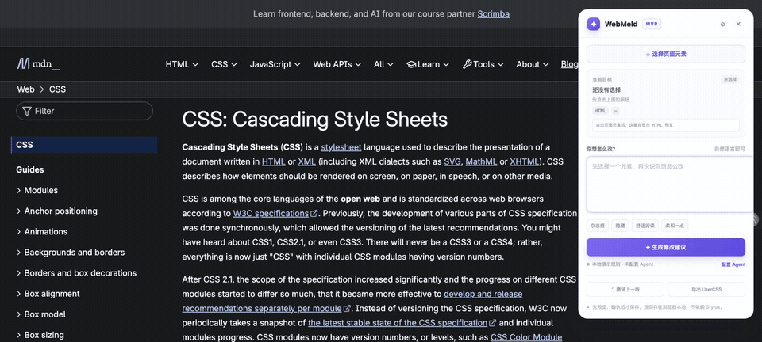
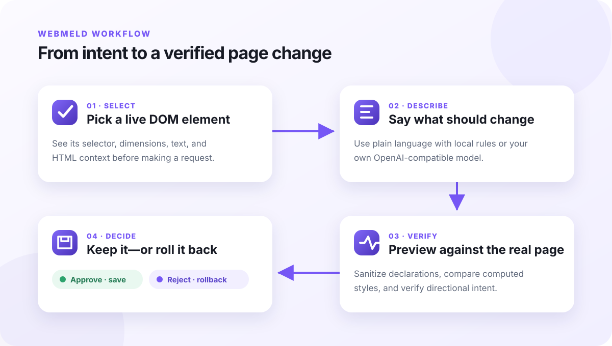

<div align="center">
  
  <h1>WebMeld</h1>
  <p><strong>用一句话，重新布置任何网页。</strong><br>选中元素，描述结果，安全预览，确认后长期保留。</p>
  <p>
    
    
    
  </p>
  <p><a href="README.md">English</a> · <a href="PRIVACY.md">隐私</a> · <a href="CONTRIBUTING.md">参与贡献</a></p>
</div>



WebMeld 是一个轻量的 Chromium 浏览器扩展。你可以直接在真实网页上选择 DOM 元素，用自然语言描述想要的效果，再由 WebMeld 生成受约束的 CSS 修改。每次修改都会先在页面上预览、读取修改前后的计算样式进行验证，只有经过你的确认才会保存。

它不依赖 Stylus，不要求注册账号，也没有 WebMeld 中转服务器。

> [查看高清 MP4 演示](assets/demo/webmeld-demo.mp4)

## 它解决什么问题

| 能力 | 说明 |
|---|---|
| **直接点选元素** | 悬停时展示范围、标签、尺寸和选择器，不需要打开开发者工具。 |
| **自然语言修改** | 放大标题、隐藏干扰、收窄正文、调整颜色和间距。 |
| **自带模型接入** | 支持用户配置 OpenAI-compatible URL、模型名与 Key。 |
| **先预览再保存** | 临时应用 CSS，并检查真实计算样式是否发生了预期变化。 |
| **失败自动撤回** | 不安全、无效或与“变大/变小”方向相反的修改不会留在页面上。 |
| **本地持久化** | 规则保存在 Chrome 本地，可刷新恢复、撤销并导出 UserCSS。 |

## 工作流程

<p align="center">
  
</p>

模型不会获得执行 JavaScript 或直接操作 DOM 的权限。模型只能提出 CSS 声明；选择器生成、安全过滤、预览、验证、保存和回滚都由扩展负责。

## 本地安装

Chrome 商店版本正在准备中，目前可以通过开发者模式安装：

1. 下载或克隆仓库。
2. 打开 `chrome://extensions`。
3. 开启右上角的**开发者模式**。
4. 点击**加载已解压的扩展程序**，选择仓库目录。
5. 打开任意 `http://` 或 `https://` 网页，点击工具栏里的 WebMeld。
6. 点击**选择页面元素**，选择目标并描述修改。

快捷键为 `Alt+Shift+M`。

运行自带演示页：

```bash
python3 -m http.server 8765
```

然后访问 <http://localhost:8765/demo-page.html>。

## 配置 Agent

未配置 Agent 时，WebMeld 会使用内置的少量本地规则。需要理解更开放的指令时，打开右上角的 Agent 设置，填写：

- **URL**：完整的 OpenAI-compatible `POST /chat/completions` 地址；
- **模型**：服务商要求的模型标识；
- **Key**：对应的 bearer token。

保存前可点击**测试连接**。请求直接从扩展后台发送到你填写的服务，不经过 WebMeld 服务器。

生成建议时，模型会收到当前页面 URL 和标题、选中元素的选择器、短文本和 HTML 摘要、尺寸、部分计算样式，以及你的指令。在敏感网页使用第三方模型前，请先阅读 [PRIVACY.md](PRIVACY.md)。

## 安全边界

- 只接受 JSON 格式、数量受限的 CSS 声明；
- 禁止模型返回选择器、`<style>`、JavaScript、`url()`、`@import` 和表达式；
- 模型修改字号时必须给出明确的 px 值；
- 预览前后读取并对比计算样式；
- 验证“变大”和“变小”的实际方向；
- 预览、应用或本地保存失败时自动回滚。

完整数据流见 [docs/ARCHITECTURE.zh-CN.md](docs/ARCHITECTURE.zh-CN.md)。

Logo 素材和使用规范见 [docs/BRAND.zh-CN.md](docs/BRAND.zh-CN.md)。

## 小是刻意的

WebMeld 的运行时大约只有 1,300 行原生 JavaScript 和 CSS，没有框架、打包器、生产依赖、账号系统或托管后端。这使它加载快，也让涉及页面数据和模型输出的关键行为更容易审查。

## 开发

扩展本身无需安装依赖。Node.js 仅用于仓库校验和生成发布包：

```bash
npm run check
npm run package
```

## 当前状态

`0.1.1` 是早期公开预览版，核心链路已经完成：选择 → 描述 → 预览 → 验证 → 应用 → 撤销 → 持久化。

下一阶段不会继续堆叠 CSS 指令，而会探索如何利用这层可验证的真实页面修改能力，连接设计意图与生产界面。

## License

[MIT](LICENSE) © 2026 MicroMilo
