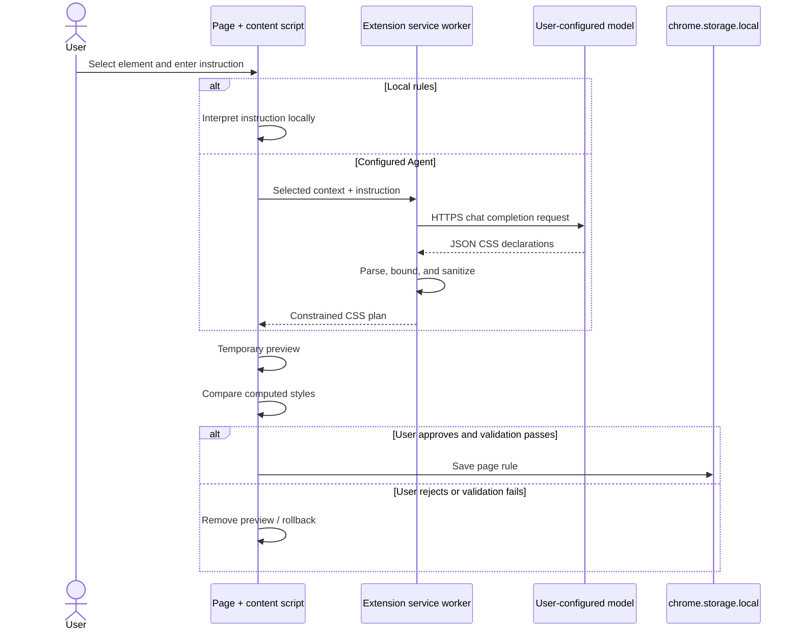

# Architecture

WebMeld is a Manifest V3 browser extension with two runtime components and no hosted backend.

## Runtime components

### Content script

`content.js` runs on regular web pages and owns all page-facing behavior:

- Shadow DOM panel rendering;
- hover inspection and element selection;
- stable-enough selector generation;
- context collection for the selected element;
- local prompt interpretation;
- CSS preview injection;
- computed-style verification;
- apply, undo, persistence, and UserCSS export.

`content.css` contains only the page-level selection overlay. Panel styles live inside the Shadow DOM so host-page CSS is less likely to affect WebMeld.

### Extension service worker

`background.js` owns privileged and network-facing behavior:

- toolbar and keyboard shortcut dispatch;
- reading Agent configuration from extension-local storage;
- sending an OpenAI-compatible Chat Completions request;
- parsing and sanitizing model output;
- returning a constrained plan to the content script.

## Data flow

## Trust boundaries

### Model output is untrusted

The model does not choose a selector and cannot return a style block or executable code. Both the service worker and content script validate declarations. Unsafe values such as remote URLs, JavaScript schemes, expressions, and legacy bindings are rejected.

### The selected page may be sensitive

The content script can read the current page because that is the product's core function. Context is collected for the user-selected element and is transmitted only after the user requests Agent generation. Users must decide whether the configured model provider is appropriate for the current page.

### Local storage is not a secret vault

Rules and Agent settings are saved in `chrome.storage.local`. This isolates them to the extension profile but does not provide a separate encryption layer. Restricted provider keys are recommended.

## Persistence model

Rules are keyed by `location.origin + location.pathname`. Query strings and fragments do not create separate rule sets. On page load, matching rules are rendered into one extension-owned `<style>` element.

## Why plain JavaScript

WebMeld intentionally avoids a framework and build-time runtime bundle. The security-sensitive path remains small enough to inspect directly, unpacked-extension development stays fast, and the published package contains only code the browser executes.

## Known boundaries

- Rules currently target a path, not a route pattern or full site.
- Selector stability depends on the host page's DOM and class naming.
- Iframes and closed Shadow DOM trees are not inspected.
- The Agent transport currently targets OpenAI-compatible Chat Completions responses.
- The interface is an early preview and is not yet localized through `chrome.i18n`.
