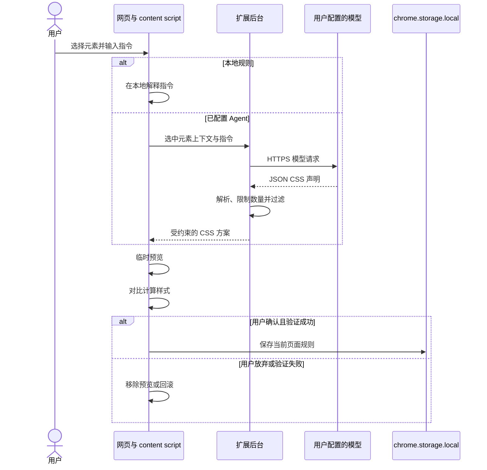

# 架构说明

WebMeld 是一个 Manifest V3 浏览器扩展，由两个运行时组件组成，没有托管后端。

## 运行时组件

### Content script

`content.js` 负责所有与网页直接交互的行为：

- 在 Shadow DOM 中渲染面板；
- 悬停检查与元素选择；
- 生成选择器；
- 收集选中元素的上下文；
- 解释本地规则；
- 注入临时 CSS 预览；
- 对比修改前后的计算样式；
- 应用、撤销、保存和导出 UserCSS。

`content.css` 只负责页面上的选择高亮。面板样式位于 Shadow DOM 内，降低与宿主网页样式互相干扰的概率。

### 扩展后台 Service Worker

`background.js` 负责有权限和网络边界的行为：

- 响应工具栏按钮和快捷键；
- 从扩展本地存储读取 Agent 配置；
- 调用 OpenAI-compatible Chat Completions 接口；
- 解析并过滤模型输出；
- 把受约束的修改方案返回 content script。

## 数据流

## 信任边界

### 不信任模型输出

模型不能决定选择器，也不能返回完整样式块或可执行代码。后台和 content script 会分别校验 CSS 声明。远程 URL、JavaScript scheme、表达式和危险的旧式绑定都会被拒绝。

### 当前网页可能包含敏感信息

扩展必须读取当前网页才能提供元素选择和样式修改。只有用户主动请求 Agent 生成时，才会收集所选元素的上下文并发送给用户配置的模型。用户需要自行判断该服务商是否适合处理当前页面。

### 本地存储不是密码保险箱

规则与 Agent 配置保存在 `chrome.storage.local`。它们与普通网页隔离，但 WebMeld 没有额外提供独立加密层，因此建议使用权限和额度受限的专用 Key。

## 持久化方式

规则按 `location.origin + location.pathname` 保存。查询参数与页面锚点不会生成单独的规则集。页面加载时，WebMeld 会把匹配的规则渲染到一个扩展管理的 `<style>` 元素中。

## 为什么使用原生 JavaScript

WebMeld 刻意不引入框架和运行时打包依赖。涉及页面数据与模型输出的关键路径足够小，可以直接审查；本地开发也只需重新加载扩展，无需构建步骤。

## 当前边界

- 规则目前按页面路径生效，不支持路由模式或整站范围。
- 选择器稳定性取决于宿主网页 DOM 与类名。
- 暂不检查 iframe 和 closed Shadow DOM。
- Agent 传输层目前面向 OpenAI-compatible Chat Completions。
- 界面尚未通过 `chrome.i18n` 完成多语言化。
